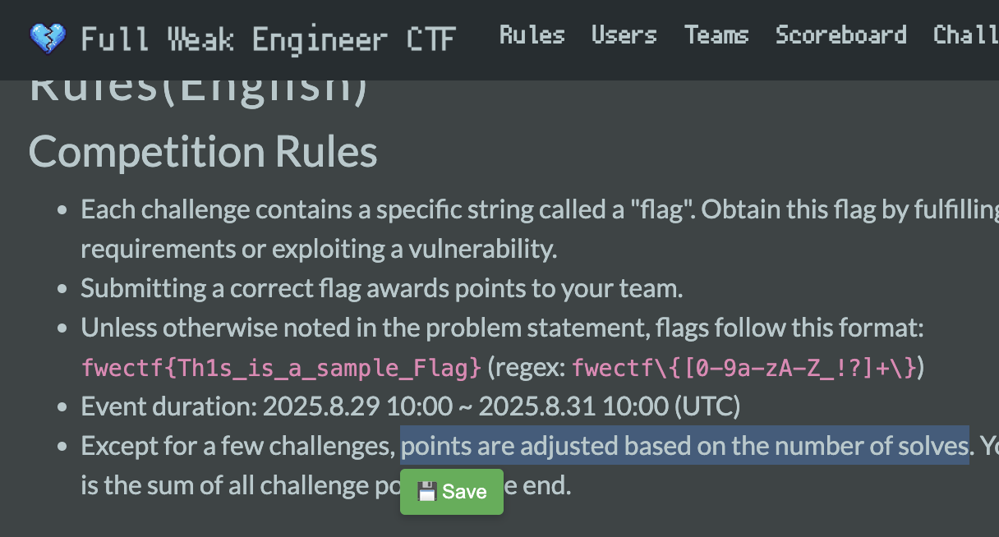
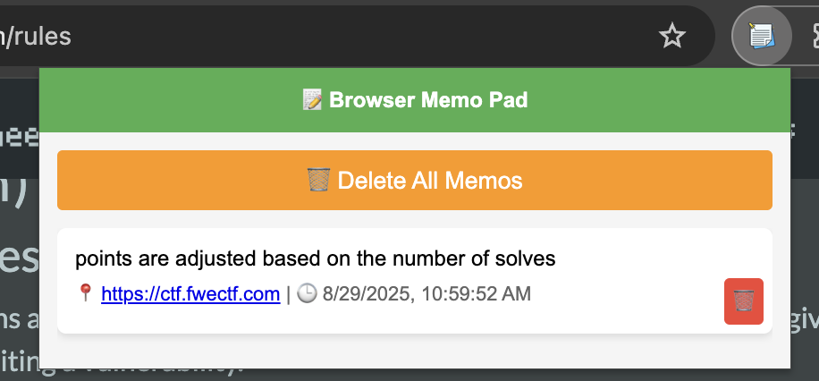

# 拡張機能の使い方

1. 拡張機能を起動した後、任意のサイト（例：https://ctf.fwectf.com/rules）にアクセスします。
2. 文字列をカーソルでなぞると「Save」ボタンが表示されます。
3. 「Save」ボタンをクリックすると、拡張機能に文字列が保存されます。
4. 拡張機能のアイコンをクリックすると保存した内容が確認できます。
5. サイトのURLをクリックすると、保存した場所まで遷移します。

# How to Use the Extension

1. After launching the extension, access any website (e.g., https://ctf.fwectf.com/rules).  
2. Highlight a text string with your cursor, and the "Save" button will appear.  
3. Click the "Save" button to save the text string to the extension.  
4. Click the extension icon to view the saved content.  
5. Clicking the site's URL will navigate you directly to the saved location.

